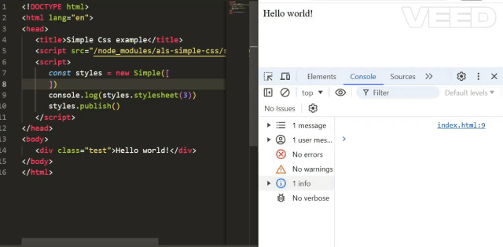

# als-simple-css


**Als-Simple-Css** is a powerful JavaScript library for dynamically constructing and managing CSS stylesheets directly from JavaScript. This flexible tool allows developers to use JavaScript features, such as imports, loops, and variables, to create CSS on the fly in the browser.



## Features:
- **Dynamic Style Creation**: Create CSS stylesheets on the fly using the full power of JavaScript, including control structures like loops and conditional statements.
- **Simplified Syntax**: Utilize shorthand notation for CSS properties, making the code more compact and readable.
- **Nested Styles**: Structure your CSS rules with nesting similar to SASS for cleaner and more organized style management.
- **Powerful Color Tools**: Includes functions for transforming and manipulating colors, facilitating dynamic theme and style changes.
- **In-browser Stylesheet Construction**: Integrate and apply styles instantly, optimizing performance and speeding up page loads.


## New in version 10.00

* Code refactoring
* Added
  * `Simple.raw(rawSimple)`
  * `Simple.styles(simples)`
  * `Simple.ColorTools`
  * `n` parameter - stylesheet(spaces,n)
  * `Simple.shorts`
    * No second parameter `shorts` in constructor
* Documentation changes

## Installation, Import, and Basic Usage

### Installation
To install `als-simple-css`, run the following command:
```bash
npm i als-simple-css
```

### Usage in Browser
Include the necessary scripts in your HTML file. Make sure to adjust the paths according to your project's structure.
```html
<!-- Optional: Include cssParser if you plan to use Simple.raw -->
<script src="/node_modules/als-css-parse/css-parser.js"></script>

<!-- Optional: Include ColorTools if you plan to use Simple.ColorTools or ColorTools -->
<script src="/node_modules/als-color-tools/color-tools.js"></script>

<script src="/node_modules/als-simple-css/simple.js"></script>
```

### Usage as CommonJS Module
For Node.js applications or when using a bundler that supports CommonJS:
```js
const Simple = require('als-simple-css');
```

### Usage as ES Module
For modern JavaScript projects that support ES Modules:
```js
import Simple from 'als-simple-css/simple.mjs';
```

## Basic Usage

### Creating Styles
You can create styles using either structured JavaScript objects or raw CSS strings. The `Simple` class provides two static methods for these purposes: `Simple.styles()` for JavaScript objects and `Simple.raw()` for raw CSS strings.

#### Using Simple.styles
This method takes an array of style objects:
```js
const arr = [
    {'.selector': { color: 'red', margin: '10px' }}
]
const styles = Simple.styles(arr);
// or 
const styles = new Simple(arr);
console.log(styles.stylesheet());
```

#### Using Simple.raw
This method parses a raw CSS string:
```js
const rawStyles = Simple.raw(`
.selector {
    color: red;
    margin: 10px;
}
`);
console.log(rawStyles.stylesheet());
```

>Tip: Use `Simple Css Syntax` plugin for VsCode to highlight the raw syntax. 

The result:
```css
.selector {color:red;margin:10px}
```

The `stylesheet` method has 2 parameters:
1. `spaces` (0 by default) - use for formating code by spaces
2. `n` ('\n' by default) - use for new line formating

The result for `stylesheet(3)`:
```css
.selector {
   color:red;
   margin:10px
}
```
## Syntax Overview
The Simple class in the Simple CSS library works with an array of style objects. Each object represents a CSS rule set/s, media query, or keyframe definition.

Let's break down how to define styles using Simple CSS:

### Basic Selectors
You start by defining a JavaScript object where the key is the CSS selector and the value is another object representing properties and their values. Here is the template for a basic selector:

```js
const simple = new Simple([
  {selector1: {
    'another-property': 'another-value'
    propertyName: 'property-value',
    selector2: {
      propertyName: 'property-value',
    },
  }},
  {selector1: {
    propertyName: 'property-value',
  }},
])
```


You can use camelCase property name (like it works in element.style) in addition to kebab-case. Like `borderWidth` instead `border-width`, `propertyValue` instead `property-value`.

Example:

```js
const simple = new Simple([
  {body: {
    backgroundColor: 'black',
    color: 'white',
    marginRight:'10px',
  }}
])
```

### @At rules

Each @at rule set, has to be in separated object. 

**Wrong**:
```js
[
   { 
      '@media query': [ /* array of style objects */ ],
      div:{/* styles */}
   }
]
```

**Right**:
```js
[
   { 
      '@media query': [ /* array of style objects */ ],
   },
   {
      div:{/* styles */}
   }
]
```


#### Media Queries
To define a media query, you use a key-value pair where the key is the full media query string and the value is an array of style objects that should apply under that media query. The format is as follows:

```js
{ '@media query': [ /* array of style objects */ ] }
```

Example:
```js
{
  '@media (max-width:800px)': [
    {
      '.some': {
        'font-size': '14px',
        'line-height': '1.5'
      }
    }
  ]
}
```

#### Keyframes

Similar to media queries, keyframes are represented as a key-value pair, where the key is @keyframes animationName and the value is an array of style objects representing the keyframe selectors (like '0%', '100%') and their corresponding style rules:

```js
{
  '@keyframes animationName': [
    {
      '0%': {
        /* styles */
      },
      '100%': {
        /* styles */
      }
    }
  ]
}
```

Example:

```js
{
  '@keyframes slide': [
    {
      '0%': {
        'transform': 'translateX(0)'
      },
      '100%': {
        'transform': 'translateX(100px)'
      }
    }
  ]
}
```

### Variables
You can use css variables as is or to use shorter syntax as shown below:
* `{$varname:'value'}` equivalent to --varname:value
* `$varname(value)` equivalent to var(--varname,value)
* `$varname` equivalent to var(--varname)

Example:
```javascript
let styles = [
   {":root":{$w:'50px'}}, // --w:50px
   {".some": {width:'$w'}}, // width:var(--w)
   {".some1": {height:'$h(50px)'}} // height:var(--h,50px)
   {".nested": {height:'$some($w)'}} // height:var(--some,var(--w))
]
```

### Calc syntax

You can use css calc function in regular way, like:

```js
[
   {'.some':{
      m:'calc(1rem / 2)',
      b:'calc(var(--space) * 2) solid black'
   }}
]
```

Or in short way, like this:
```js
[
   {'.some':{
      m:'[1rem/2]',
      b:'[$space*2] solid black'
   }}
]
```

The spaces around operation sign added automatically. 

### !important
By using ``!`` in property's value, you add ``!important``. 

For example:
```javascript
let styles = [
   {'.test':{color:'red'}},
   {'.test':{color:'green !'}}, // color: green !important
]
```

### Comments and Charset Declarations

With Simple CSS, you can insert comments or any other string such as charset declarations into your styles array. These are inserted as separate string items in the array.

For instance, if you want to add a comment, you can include it as a string in the styles array, like this:

```js
const styles = new Simple([
   {'.test':{c:'red'}},
   '# comment ', // /* comment */
   {'.test2':{c:'green'}},
])
```

Similarly, you can add a charset declaration to the stylesheet. For example, if you want to specify UTF-8 as the charset, you can do so as follows:

```js
const styles = new Simple([
   '@charset "UTF-8";',
   {'.test':{c:'red'}},
   {'.test2':{c:'green'}},
])
```

### Nested styles

You can use nested styles like this:
```js
const simple = new Simple([{
   'div': { 
      color: 'blue',
      ':hover': { color: 'red' },
      ':focus': { color: 'green' },
   },
}]).stylesheet(3)
```

The result:
```css
div {
   color:blue
}
div:hover {
   color:red
}
div:focus {
   color:green
}
```
## Property Shortcuts
In addition to the main syntax, the Simple class also provides an extensive list of property shortcuts. These are shortened representations of common CSS properties, designed to make your styles more concise and easier to write. 

For example, instead of writing 'background-color': 'red', you can use the bgc shortcut:
```js
{
  body: {
    bgc: 'red'
  }
}
```

Below are all the available shortcuts and their corresponding CSS properties:
| Shortcut | CSS Property |
|----------|--------------|
| a | animation |
| bgc | background-color |
| c | color |
| bg | background |
| bgi | background-image |
| b | border |
| br | border-right |
| bl | border-left |
| bt | border-top |
| bb | border-bottom |
| bc | border-color |
| brc | border-right-color |
| blc | border-left-color |
| btc | border-top-color |
| bbc | border-bottom-color |
| bs | border-style |
| brs | border-right-style |
| bls | border-left-style |
| bts | border-top-style |
| bbs | border-bottom-style |
| bw | border-width |
| brw | border-right-width |
| blw | border-left-width |
| btw | border-top-width |
| bbw | border-bottom-width |
| radius | border-radius |
| o | outline |
| oc | outline-color |
| os | outline-style |
| ow | outline-width |
| maxw | max-width |
| minw | min-width |
| h | height |
| w | width |
| maxh | max-height |
| minh | min-height |
| of | overflow |
| ofx | overflow-x |
| ofy | overflow-y |
| scrollb | scroll-behavior |
| p | padding |
| m | margin |
| pr | padding-right |
| pl | padding-left |
| pt | padding-top |
| pb | padding-bottom |
| mr | margin-right |
| ml | margin-left |
| mt | margin-top |
| mb | margin-bottom |
| d | display |
| flexw | flex-wrap |
| flexg | flex-grow |
| flexdir | flex-direction |
| ai | align-items |
| ac | align-content |
| jc | justify-content |
| gcols | grid-template-columns |
| grows | grid-template-rows |
| gacols | grid-auto-columns |
| garows | grid-auto-rows |
| areas | grid-template-areas |
| area | grid-area |
| dir | direction |
| textt | text-transform |
| ta | text-align |
| td | text-decoration |
| ws | white-space |
| ww | word-wrap |
| ff | font-family |
| to | text-overflow |
| ls | letter-spacing |
| lh | line-height |
| wb | word-break |
| fv | font-variant |
| fs | font-size |
| fw | font-weight |
| fstyle | font-style |
| f | font |
| pos | position |
| z | z-index |
| tr | transform |
| cur | cursor |


### Adding custom shortcuts

You can easily add your own shortcuts, by adding second parameter to constructor. 

Here is the example:

```js
Simple.shorts.aic = 'animation-iteration-count';
Simple.shorts.atf = 'animation-timing-function';
const styles = [
   {'.some':{
      aic:'3',
      atf:'linear'
   }}
]
const simple = new Simple(styles)
console.log(simple.stylesheet())
```

The output:
```css
.some {
   animation-iteration-count:3;
   animation-timing-function:linear
}
```


## Publish tools

Once you have defined your styles, you create a new instance of the Simple class and pass the styles array to the constructor. After that, you can either publish the styles to the browser using the publish() method, or retrieve the raw stylesheet using the stylesheet() method.

> This method available only in browser's version

Example:

```js
const styles = [ /* your styles here */ ];

const simple = new Simple(styles);

// Publish the styles to the browser:
simple.publish();

// Or retrieve the raw stylesheet:
const rawStyles = simple.stylesheet(spaces,n);
```

If `spaces` is undefined, you getting minified version. Otherwise it formated by spaces parameter wich is number of spaces. 
The `n` parameter is a line separator. By default it's `\n`.

## Variable Management

You can manage global css variables with `Simple.$(varName,varValue,varValue2)` method. Here how it works:

```javascript
Simple.$('w') // return 50px
Simple.$('w','100px') // Changing --w to 100px
Simple.$('w','100px','50px') // if w=50px, change to 100px. If w=100px, change to 50px. Else - do nothing. 
```

Here is the example of usage:

```html
<script>
new Simple([
   {":root": {$d:'none'}},
   {".block": {d:'$d'}},
])
</script>

<button onclick="Simple.$('d','none','block')">Hide/show</button>
<div class="block">Hello</div>
```

> This method available only in browser's version
## Color Tools

The Node version has static property `Simple.ColorTools` which is `ColorTools` class dependency. 
You can view documentation in [als-color-tools](https://www.npmjs.com/package/als-color-tools)
## Build and Watch with NodeJs

The folowing example will create css file:

build.js
```js
const Simple = require('als-simple-css')
const styles = require('./styles.js')
const css = Simple.raw(styles).stylesheet(3)
require('fs').writeFileSync('./styles.css',css,'utf-8')
```

You can watch for changes with Node watcher (Node v18.11 and higher):
```bash
node --watch build.js
```

